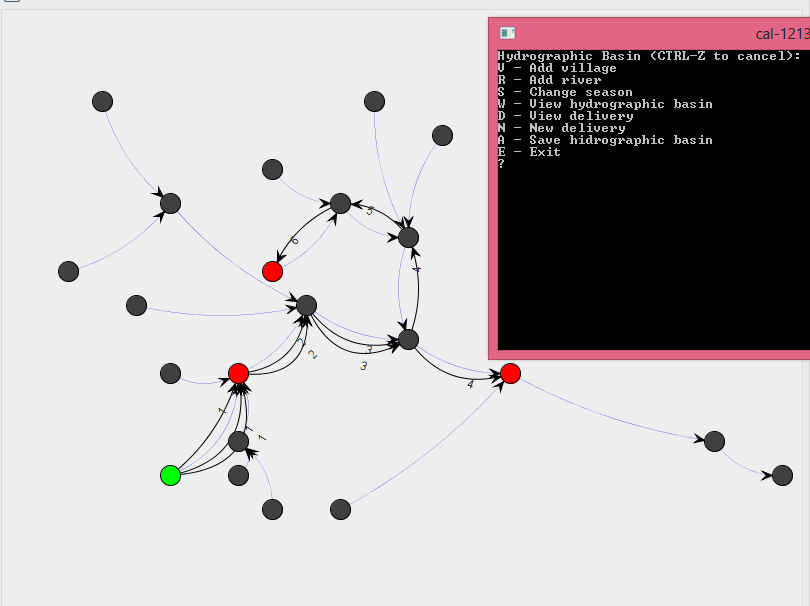
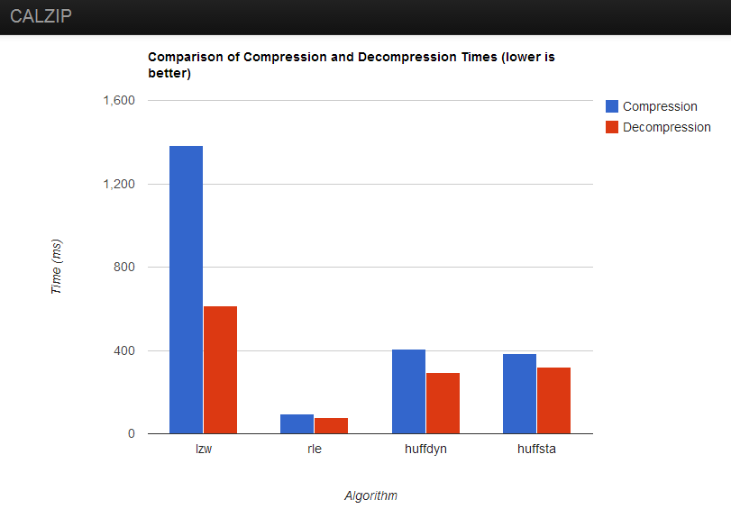

Project1
========

**Simulation of a delivery routing company**

graphs, Dijkstra's algorithm, topological order, breath-first search

---

Project2
========

**Implementation and comparison of multiple compression algorithms**

Huffman Encoding (static and dynamic), Keyword Encoding, Lempel-Ziv-Welch (LZW), Run-Length Encoding (RLE)

`calzip --help`

    Generic options:
      -v [ --version ]      print version string
      -h [ --help ]         produce help message
    
    Generators:
      --generator arg       Data generator, can be 'words', 'chars' or 'file'.
      --gen-min arg (=1)    Minimum number of words or chars.
      --gen-max arg (=100)  Maximum number of words or chars.
      --gen-count arg (=10) Number of files to create.
    
    Available algorithms:
      --lzw                 Run Lempel-Ziv-Welch
      --rle                 Run Run-length encoding
      --key                 Run Keyword encoding
      --huffdyn             Run dynamic Huffman coding
      --huffsta             Run static Huffman coding
      --all                 Run all the above, except Keyword Encoding because it's
                            SLOW.
    
    Configuration:
      -c [ --compress ]     Compress file
      -d [ --decompress ]   Decompress file
      -p [ --plot ]         Create charts and plots comparing the selected
                            algorithms
      -s [ --stats ]        Write simple statistics about compression and/or
                            decompression
